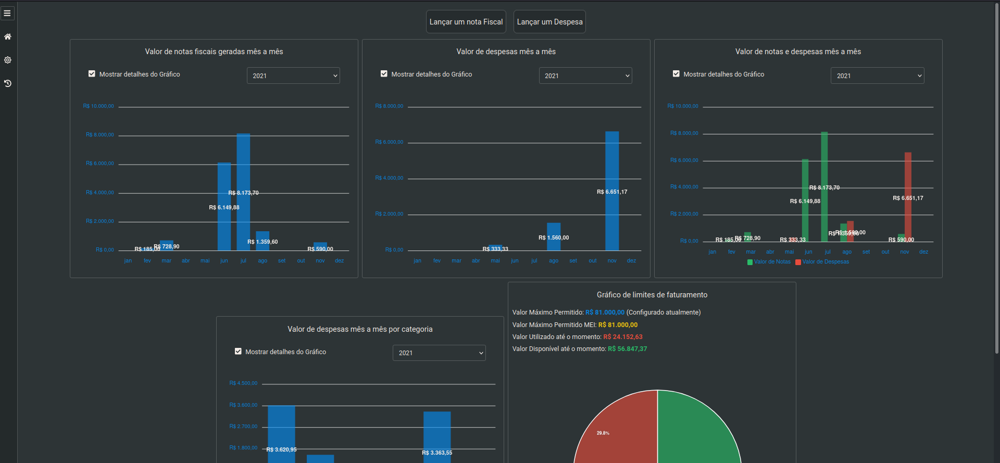
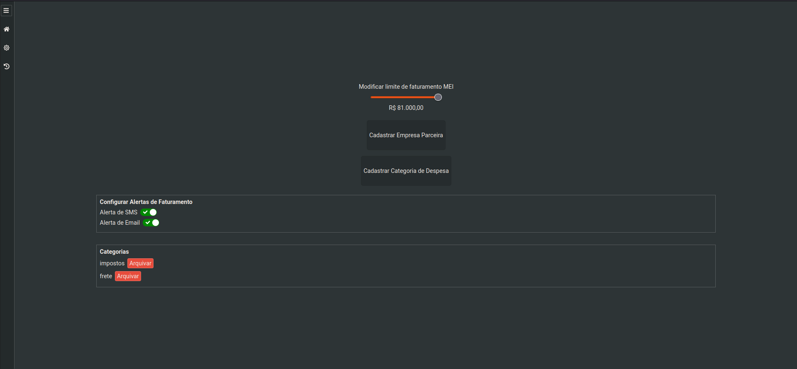
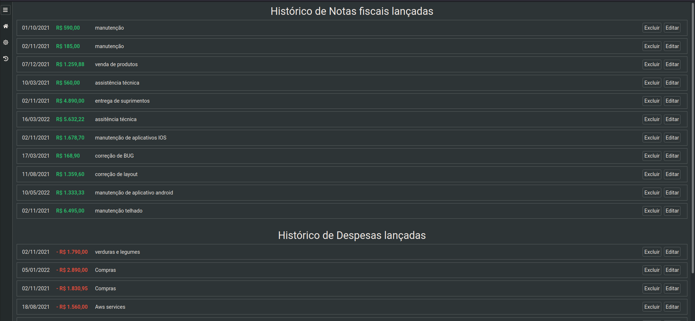

# Vibbra Teste [INVOICES-EXPENSES]

Esse projeto foi criado utilizando o [Create React App](https://github.com/facebook/create-react-app).

## Detalhes

Empreendedores formalizados como Microempreendedores Individuais que buscam uma forma automática de organizar suas Receitas (geração de Notas Fiscais) para evitar surpresas com pagamento de impostos ao final do ano.

## Ferramentas utilizadas

- 
- <b>:atom_symbol: -- React-JS</b>
- <b>:nail_care: -- Styled Components</b>

## Implementações adicionais

- <b>:high_brightness: -- React-Redux</b>
- <b>:tada: -- Deploy</b>
- <b>:anchor: -- React Hooks</b>

## Utilizando

Para utilizar a aplicação primeiro é necessário você cadastrar ao menos 1 empresa e 1 categoria de despesa, isso é feito na tela de "Preferências", após isso, você já estará apto a lançar uma nota fiscal ou uma despesa no nome da empresa, caso seja despesa você pode anexar a categoria.

pontos do desafio que foram implementados

- Cadastro de empresa
- Cadastro de Categoria
- Lançamento de nota fiscal utilizando o cnpj da empresa para pesquisar a empresa
- Lançamento de despesa utilizando o nome da categoria para pesquisar a categoria
- Grafico de notas geradas a cada mês com filtro por ano
- Grafico de despesas geradas a cada mês com filtro por ano
- Gráfico de notas e despesas geradas a cada mês com filtro por ano
- Gráfico indicativo de valor permitido/utilizado/disponível para empreendedor MEI
- Ajuste de limite máximo para MEI (esse limite quando alterado reflete no gráfico indicativo disponível de valor para gerar uma nova nota fiscal)
- Habilitar/Desabilitar envio de alertas por SMS ou Email
- Listagem de notas fiscais lançadas com a possibilidade de editar ou excluir qualquer nota em qualquer campo da mesma
- Listagem de despesas com a possibilidade de editar qualquer campo ou excluir qualquer despesa
- Telas Home , Preferências , Histórico

## Extras

- Essa aplicação conta com gerenciamento de estado global utilizando os melhores padrões propostos pelo React Redux
- Essa aplicação possui um "Theme-Swicher" ou seja, você pode optar por utilizada com os temas light e dark
- A maioria dos componentes da interface da aplicação foram "componentizados" para reutilização

:rocket: Você pode conferir a versão online aqui <a href="https://invoice-vibbra-test-project.vercel.app/" rel="">Vercel Deployment</a>.

:rocket: Aqui você pode conferir um vídeo de como a aplicação está funcionando <a href="https://www.youtube.com/watch?v=fN9K6EmgmUg&ab_channel=CarlosRodrigues" rel="">You Tube</a>.

:octocat: Ou, siga os passos abaixo...

(1) Rode o comando $ yarn to install all the dependencies

(2) Rode o comando $ yarn start to executes the application

## Preview

## Nota

Para esse projeto não foi utilizado uma api externa, o armazenamento dos dados é feio através do armazenamento do navegador, nos detalhes do desafio não era obrigatório utilizar um serviço externo por isso decidi fazer dessa maneira
